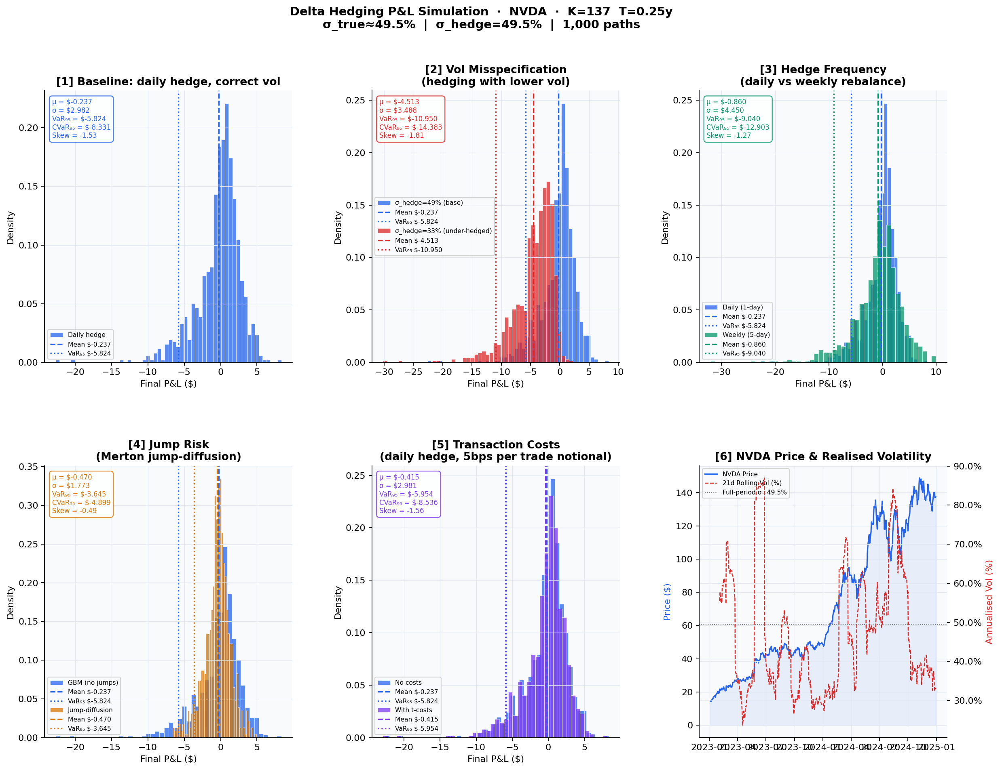

# Delta Hedging PnL Simulator

> *Why do traders lose money even when they use the right model?*

A Python project that simulates the P&L of a delta-hedged short call position across five stress scenarios, using real market data from **yfinance** and bootstrapped Monte Carlo paths.

I studied how discretely hedged option positions generate non-zero PnL even under correct pricing assumptions, and analysed how volatility misspecification and hedge frequency affect tail risk and CVaR.

---

## What It Does

You sell a European call option. You hedge it. You should break even.

But you don't — and this project shows exactly why.

The simulation runs 1,000+ paths per scenario and measures how each real-world imperfection erodes the hedge:

| Scenario | What breaks |
|---|---|
| **Baseline** | Discrete hedging (not continuous) |
| **Vol misspecification** | Hedging with the wrong implied vol |
| **Hedge frequency** | Rebalancing weekly instead of daily |
| **Jump risk** | Merton jump-diffusion paths |
| **Transaction costs** | 5 bps per trade, compounded daily |

### Output



---

## Project Structure

```
delta_hedging/
│
├── models/
│   └── black_scholes.py      # Price, Delta, Gamma, Vega, Theta
│
├── simulation/
│   ├── market_data.py        # yfinance downloader + historical vol
│   └── gbm.py                # GBM + Merton jump-diffusion
│
├── hedging/
│   └── delta_hedge.py        # Core hedging engine (cash, stock, rebalancing)
│
├── analysis/
│   └── pnl_analysis.py       # 6-panel figure + summary table
│
└── main.py                   # CLI entry point
```

---

## Quickstart

```bash
# Clone and install dependencies
git clone https://github.com/your-username/delta-hedging-sim.git
cd delta-hedging-sim
pip install -r requirements.txt

# Run with defaults (SPY, 3-month ATM call, 1000 paths)
python main.py

# Custom run
python main.py --ticker AAPL --T 0.5 --n_paths 2000 --moneyness 1.05
```

### CLI Options

| Flag | Default | Description |
|---|---|---|
| `--ticker` | `SPY` | Stock ticker |
| `--start` | `2020-01-01` | Historical data start |
| `--end` | `2024-12-31` | Historical data end |
| `--T` | `0.25` | Expiry in years |
| `--moneyness` | `1.0` | K / S₀ (1.0 = ATM) |
| `--n_paths` | `1000` | Monte Carlo paths |
| `--seed` | `42` | Random seed |
| `--output` | `output/...png` | Figure save path |

---

## Requirements

```
numpy
scipy
matplotlib
pandas
yfinance
seaborn
```

Install with:

```bash
pip install numpy scipy matplotlib pandas yfinance seaborn
```

---

## How the Hedging Engine Works

At each time step $t$:

1. Compute $\Delta_t = \frac{\partial C}{\partial S}$ using Black-Scholes with `sigma_hedge`
2. Adjust stock position by $\Delta_t - \Delta_{t-1}$
3. Debit/credit cash account (+ interest accrual at rate $r$)
4. Optionally charge transaction cost per share traded

At expiry:

$$\text{PnL} = \text{Cash}_T + \Delta_T \cdot S_T - \max(S_T - K,\, 0) - \text{Total costs}$$

Paths are generated by **bootstrapping real daily log-returns** (with replacement) from historical data — preserving empirical fat tails and volatility clustering without model assumptions.

---

## Key Findings

All PnL distributions show **negative skew** — the defining signature of a short option position:

- **Discrete hedging alone** introduces $\sigma_{\text{PnL}} \approx \$0.74$ even with correct vol
- **Vol misspecification** (using 2/3 of true vol) shifts the mean by **−$1.25** and doubles the standard deviation — a systematic, not random, loss
- **Weekly rebalancing** quadruples variance compared to daily, with roughly equal mean — pure gamma risk accumulation
- **Jump paths** produce CVaR₉₅ of **−$23.7** vs −$2.0 baseline — delta hedging offers almost no protection against gap moves
- **Transaction costs** at 5 bps/trade add a steady drag that compounds significantly at daily frequency

---

## Extensions

Some directions to take this further:

- [ ] **Vega hedging** — add a second option to neutralise vol exposure
- [ ] **Stochastic vol** — replace constant σ with a Heston model path
- [ ] **Real options data** — pull implied vol surface from yfinance/CBOE
- [ ] **Optimal hedge frequency** — minimise variance of PnL net of costs
- [ ] **PnL attribution** — decompose into delta, gamma, theta, and vega components
- [ ] **Interactive dashboard** — Streamlit app for real-time parameter exploration

---

## References

- Black, F. & Scholes, M. (1973). *The Pricing of Options and Corporate Liabilities*
- Merton, R. (1976). *Option pricing when underlying stock returns are discontinuous*
- Taleb, N. (1997). *Dynamic Hedging: Managing Vanilla and Exotic Options*
- Hull, J. (2022). *Options, Futures, and Other Derivatives* (11th ed.)

---

